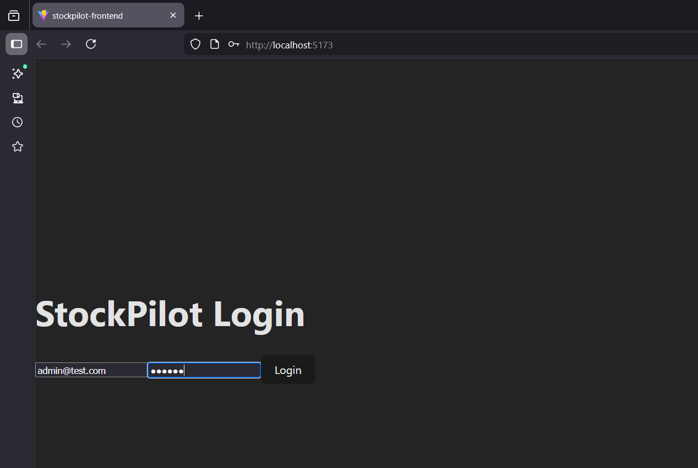
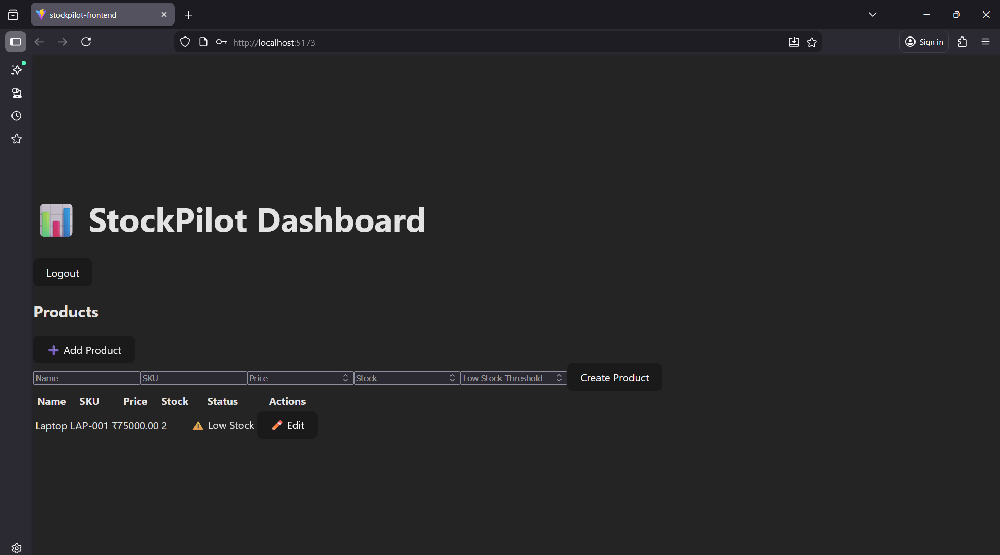
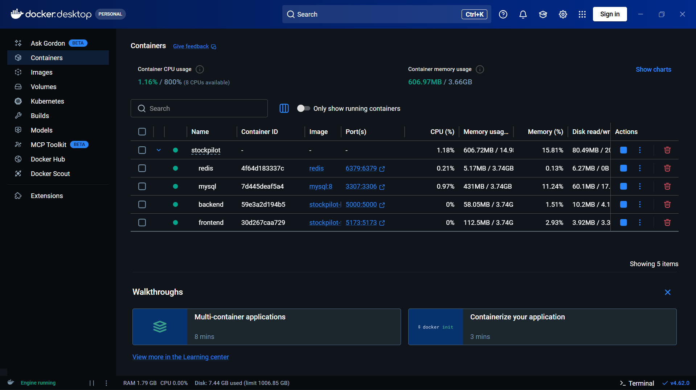

# 🚀 StockPilot — Smart Inventory Management System

StockPilot is a production-style full-stack inventory management platform designed to demonstrate scalable backend architecture, Redis caching, and containerized deployment using Docker Compose.

Built with a strong focus on **performance, clean architecture, and real-world backend patterns**.

---

## ✨ Key Features

* 🔐 JWT-based Authentication & Role-Based Access Control (RBAC)
* 📦 Complete Product Management (Create, Read, Update)
* ⚡ Redis Caching Layer for high-performance reads
* 🔄 Automatic Cache Invalidation on write operations
* 📊 Sales Analytics & Low-Stock Detection
* 🐳 Fully Dockerized Multi-Service Architecture
* 🧱 Modular Backend Structure (controllers/services/routes)
* 🎯 Production-style error handling and validation
* 💻 Clean React dashboard UI

---

## 🧠 System Architecture

```
Frontend (React)
      ↓
Backend (Node + Express)
      ↓
 ┌───────────────┬───────────────┐
 │               │               │
MySQL        Redis Cache     JWT Auth
(Database)    (Performance)   (Security)
```

---

## 🛠️ Tech Stack

### Backend

* Node.js
* Express.js
* MySQL
* Redis
* JWT Authentication
* REST APIs

### Frontend

* React.js
* Tailwind CSS

### DevOps & Tools

* Docker
* Docker Compose
* Git & GitHub

---

## 🚀 Getting Started (Docker — Recommended)

### 1️⃣ Clone the repository

```bash
git clone https://github.com/znixxx30/Stockpilot.git
cd Stockpilot
```

### 2️⃣ Start all services

```bash
docker compose up --build
```

### 3️⃣ Access the application

* Frontend: http://localhost:5173
* Backend API: http://localhost:5000

---

## 🔐 Test Credentials

You can register a new admin user via the API or database.

Example login payload:

```json
{
  "email": "testadmin@test.com",
  "password": "123456"
}
```

---

## ⚡ Redis Caching Strategy

StockPilot implements a **read-through caching pattern**:

* Product list is cached in Redis
* Cache TTL improves read performance
* Cache automatically invalidates on:

  * product creation
  * product update

This ensures **strong consistency + high performance**.

---

## 📂 Project Structure

```
Stockpilot/
├── stockpilot/              # Backend (Node + Express)
│   ├── src/
│   │   ├── controllers/
│   │   ├── services/
│   │   ├── routes/
│   │   ├── middlewares/
│   │   └── config/
│
├── stockpilot-frontend/     # React Frontend
├── docker-compose.yml
└── README.md
```

---

## 🧪 API Highlights

### Auth

* `POST /api/auth/register`
* `POST /api/auth/login`

### Products

* `GET /api/products`
* `POST /api/products`
* `PUT /api/products/:id`

---

## 🐳 Docker Services

The application runs using Docker Compose with:

* MySQL container
* Redis container
* Backend container
* Frontend container

This mirrors **real production microservice setups**.

---

## 📸 Screenshots

### 🔐 Login Page


### 📊 Dashboard View


### 🐳 Docker Services Running

---

## 🎯 What This Project Demonstrates

* Backend system design fundamentals
* Caching and performance optimization
* Containerized deployment
* Clean REST API architecture
* Real-world debugging and integration skills

---

## 👨‍💻 Author

**Anshuman Singh**

Backend Developer | Node.js | Systems Enthusiast

---

## ⭐ If you found this useful

Give the repo a star — it helps visibility!
